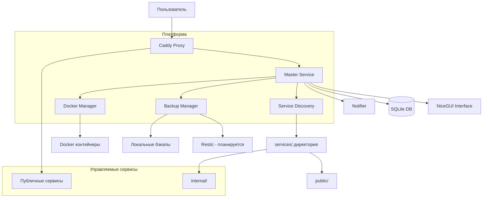

# Apps Service Opus Platform


**Платформа для автоматического управления сервисами с динамической маршрутизацией, мониторингом и резервным копированием**

## 📖 Оглавление

- [🚀 Быстрый старт (5 минут)](#-быстрый-старт-5-минут)
- [✨ Особенности](#-особенности)
- [🏗️ Архитектура](#️-архитектура)
- [📦 Установка](#-установка)
- [🎯 Примеры использования](#-примеры-использования)
- [🛠️ Platform CLI](#️-platform-cli)
- [🔧 API документация](#-api-документация)
- [🧪 Тестирование](#-тестирование)
- [🐛 Устранение неполадок](#-устранение-неполадок)
- [🔄 Разработка и контрибьютинг](#-разработка-и-контрибьютинг)
- [🗺️ Roadmap](#️-roadmap)
- [📄 Лицензия](#-лицензия)

## 🚀 Быстрый старт (5 минут)

1. **Клонируйте репозиторий:**

   ```bash
   git clone https://github.com/your-org/apps-service-opus.git
   cd apps-service-opus
   ```

2. **Запустите установочный скрипт:**

   ```bash
   ./install.sh
   ```

   > Скрипт установит все зависимости, настроит окружение и предложит установить Platform CLI.

3. **Запустите платформу:**

   ```bash
   make dev
   ```

   Или с Docker Compose:

   ```bash
   docker compose -f _core/master/docker-compose.yml -f _core/master/docker-compose.dev.yml up -d
   ```

4. **Откройте веб-интерфейс:**
   - Перейдите по адресу: `http://localhost:8000`
   - Или через Caddy: `http://apps.localhost` (если настроен)

5. **Создайте первый сервис:**
   ```bash
   platform new my-app public
   platform deploy my-app
   ```

## ✨ Особенности

### 🎯 Автоматическое управление сервисами

- **Service Discovery** – автоматическое обнаружение сервисов через манифесты `service.yml` в директориях `services/{public,internal}/`
- **Динамическая маршрутизация** – Caddy конфигурации генерируются из Jinja2-шаблонов в реальном времени
- **Двойная аутентификация** – поддержка встроенной аутентификации и Keycloak OAuth2
- **Локальные переопределения** – использование `service.local.yml` для разработки (не коммитится)

### 🔧 Технический стек

- **Backend**: Python 3.12 + FastAPI + NiceGUI (веб-интерфейс)
- **Прокси**: Caddy с автоматическим SSL/TLS (Let's Encrypt)
- **Контейнеризация**: Docker + Docker Compose
- **База данных**: SQLite (легковесная) с возможностью миграции на PostgreSQL
- **CLI**: Изолированный Platform CLI с автономным venv

### 📊 Мониторинг и управление

- **Health checks** каждые 30 секунд с настраиваемыми эндпоинтами
- **Централизованное логирование** с фильтрацией и поиском
- **Резервное копирование** через BackupManager (локальное + планируется Restic)
- **Уведомления** через Telegram (в разработке)

## 🏗️ Архитектура

### Общая схема платформы



### Компоненты платформы

| Компонент             | Назначение                                   | Расположение                  |
| --------------------- | -------------------------------------------- | ----------------------------- |
| **Master Service**    | Центральный сервис управления (API + UI)     | `_core/master/`               |
| **Caddy Proxy**       | Обратный прокси с динамической конфигурацией | `_core/caddy/`                |
| **Platform CLI**      | Командный интерфейс для управления           | `_core/platform-cli/`         |
| **Backup Service**    | Резервное копирование и восстановление       | `_core/backup/`               |
| **Service Discovery** | Сканирование и регистрация сервисов          | `services/{public,internal}/` |

### Поток данных

1. **Обнаружение сервисов**: Master Service сканирует `services/` каждые 60 секунд
2. **Генерация конфигураций**: Для каждого сервиса создается Caddy конфиг из шаблонов
3. **Применение конфигураций**: Caddy API обновляет маршрутизацию в реальном времени
4. **Мониторинг**: Health Checker проверяет доступность сервисов
5. **Управление**: Пользователь взаимодействует через UI или CLI

## 📦 Установка

### Предварительные требования

- **Docker** и **Docker Compose** (версия 2.0+)
- **Python 3.12** (для разработки)
- **Poetry** (менеджер зависимостей)
- **Git**

### Полная установка (рекомендуется)

```bash
# 1. Клонирование репозитория
git clone https://github.com/your-org/apps-service-opus.git
cd apps-service-opus

# 2. Настройка окружения
cp .env.example .env
# Отредактируйте .env при необходимости

# 3. Запуск установочного скрипта
./install.sh

# 4. Запуск всех компонентов
make start-all
```

### Установка только Master Service

```bash
cd _core/master

# Установка зависимостей через Poetry
poetry install --with dev

# Запуск в режиме разработки
poetry run dev

# Или через Make
make dev
```

### Docker установка

```bash
# Сборка и запуск всех сервисов
docker compose -f _core/master/docker-compose.yml \
               -f _core/caddy/docker-compose.yml \
               up -d
```

## 🎯 Примеры использования

### Пример 1: Статический веб-сайт

**Структура сервиса:**

```
services/public/my-static-site/
├── docker-compose.yml
├── service.yml
└── public/
    ├── index.html
    └── style.css
```

**service.yml:**

```yaml
name: my-static-site
display_name: My Static Site
version: "1.0.0"
description: Пример статического сайта
type: static
visibility: public
routing:
  - type: domain
    domain: mysite.example.com
    internal_port: 80
    container_name: my-static-site
health:
  enabled: true
  endpoint: /
  interval: 30s
```

**docker-compose.yml:**

```yaml
version: "3.8"
services:
  web:
    image: nginx:alpine
    container_name: my-static-site
    volumes:
      - ./public:/usr/share/nginx/html:ro
    ports:
      - "127.0.0.1:8080:80"
    restart: unless-stopped
```

### Пример 2: Docker Compose приложение с API

**service.yml:**

```yaml
name: api-service
display_name: API Service
version: "2.1.0"
description: Микросервис с REST API
type: docker-compose
visibility: internal # Внутренний сервис
routing:
  - type: subfolder
    base_domain: api.internal.example.com
    path: /api/v1
    internal_port: 3000
    strip_prefix: true
health:
  enabled: true
  endpoint: /health
  interval: 15s
  timeout: 5s
backup:
  enabled: true
  schedule: "0 2 * * *" # Ежедневно в 2:00
  retain_days: 30
```

### Пример 3: Локальная разработка с переопределениями

Создайте `service.local.yml` рядом с `service.yml`:

```yaml
# service.local.yml (не коммитится)
routing:
  - type: port
    internal_port: 3000
    external_port: 3001 # Локальный порт для разработки

health:
  endpoint: /debug/health # Альтернативный эндпоинт для разработки

env:
  DEBUG: "true"
  DATABASE_URL: "postgresql://localhost:5432/dev"
```

## 🛠️ Platform CLI

Platform CLI – изолированная утилита командной строки для управления платформой.

### Установка CLI

```bash
# Способ 1: Через install.sh (рекомендуется)
cd /apps
./install.sh

# Способ 2: Ручная установка через pipx
pipx install /apps/_core/platform-cli

# Способ 3: Через Docker
docker build -t platform-cli _core/platform-cli/
alias platform="docker run --rm -v /var/run/docker.sock:/var/run/docker.sock platform-cli"
```

### Команды CLI

| Команда                                           | Описание                | Пример                                         |
| ------------------------------------------------- | ----------------------- | ---------------------------------------------- |
| `platform list`                                   | Список всех сервисов    | `platform list`                                |
| `platform new <name> [public\|internal]`          | Создать новый сервис    | `platform new myapp public`                    |
| `platform deploy <service>`                       | Деплой сервиса          | `platform deploy myapp`                        |
| `platform deploy <service> --build`               | Деплой с пересборкой    | `platform deploy myapp --build`                |
| `platform stop <service>`                         | Остановка сервиса       | `platform stop myapp`                          |
| `platform restart <service>`                      | Перезапуск сервиса      | `platform restart myapp`                       |
| `platform status [service]`                       | Статус сервиса(ов)      | `platform status`                              |
| `platform logs <service>`                         | Просмотр логов          | `platform logs myapp`                          |
| `platform logs <service> --follow`                | Логи в реальном времени | `platform logs myapp -f`                       |
| `platform backup <service>`                       | Создать бэкап           | `platform backup myapp`                        |
| `platform backup <service> --restore <backup_id>` | Восстановить из бэкапа  | `platform backup myapp --restore 20240101`     |
| `platform reload`                                 | Перезагрузить Caddy     | `platform reload`                              |
| `platform info`                                   | Информация о платформе  | `platform info`                                |
| `platform config get <key>`                       | Получить конфигурацию   | `platform config get caddy.domain`             |
| `platform config set <key> <value>`               | Установить конфигурацию | `platform config set caddy.domain example.com` |

### Примеры работы с CLI

```bash
# Создание и деплой нового сервиса
platform new blog public
cd services/public/blog
# ... добавляем docker-compose.yml и service.yml
platform deploy blog --build

# Мониторинг состояния
platform status
platform logs blog --follow

# Управление бэкапами
platform backup blog
platform backup blog --list
platform backup blog --restore 20240419_120000

# Перезагрузка прокси после изменений
platform reload
```

## 🔧 API документация

Master Service предоставляет REST API для интеграции и автоматизации.

### Основные эндпоинты

| Метод    | Путь                             | Описание                |
| -------- | -------------------------------- | ----------------------- |
| `GET`    | `/api/v1/services`               | Список всех сервисов    |
| `POST`   | `/api/v1/services`               | Создание нового сервиса |
| `GET`    | `/api/v1/services/{name}`        | Информация о сервисе    |
| `PUT`    | `/api/v1/services/{name}/deploy` | Деплой сервиса          |
| `DELETE` | `/api/v1/services/{name}`        | Удаление сервиса        |
| `GET`    | `/api/v1/health`                 | Health check платформы  |
| `GET`    | `/api/v1/backups`                | Список бэкапов          |
| `POST`   | `/api/v1/backups/{service}`      | Создание бэкапа         |
| `GET`    | `/api/v1/logs`                   | Получение логов         |
| `POST`   | `/api/v1/caddy/reload`           | Перезагрузка Caddy      |

### Документация API

- **Swagger UI**: `http://localhost:8000/docs`
- **ReDoc**: `http://localhost:8000/redoc`
- **OpenAPI схема**: `http://localhost:8000/openapi.json`

### Пример использования API

```bash
# Получение списка сервисов
curl -X GET "http://localhost:8000/api/v1/services" \
  -H "Authorization: Bearer $TOKEN"

# Деплой сервиса
curl -X PUT "http://localhost:8000/api/v1/services/myapp/deploy" \
  -H "Authorization: Bearer $TOKEN"

# Создание бэкапа
curl -X POST "http://localhost:8000/api/v1/backups/myapp" \
  -H "Authorization: Bearer $TOKEN"
```

## 🧪 Тестирование

Платформа использует трехуровневую систему тестирования:

### 1. Unit тесты

```bash
cd _core/master
poetry run pytest tests/unit/ -v
```

### 2. Интеграционные тесты

```bash
# Требуется Docker-in-Docker (DinD) окружение
cd _core/master
poetry run pytest tests/integration/ -v
```

### 3. Full-deploy-cycle тесты

```bash
# Полный цикл развертывания тестового сервиса
cd infra/test-env
./test_full_cycle.sh
```

### Запуск всех тестов

```bash
make test              # Только unit тесты
make test-integration  # Интеграционные тесты
make test-all          # Все тесты
make test-cov          # С покрытием кода
```

### Генерация отчетов

```bash
# HTML отчет о покрытии
poetry run pytest --cov=app --cov-report=html

# Бейдж покрытия
poetry run coverage-badge -o coverage.svg
```

## 🐛 Устранение неполадок

### Частые проблемы и решения

#### Проблема 1: Caddy не генерирует конфигурации

**Симптомы**: Сервисы не доступны через прокси, но работают напрямую по порту.

**Решение:**

```bash
# 1. Проверьте логи Caddy
docker logs _core-caddy-1

# 2. Перезагрузите конфигурацию Caddy
platform reload

# 3. Проверьте, что Master Service обнаруживает сервисы
curl http://localhost:8000/api/v1/services

# 4. Проверьте шаблоны Caddy
ls -la _core/caddy/templates/
```

#### Проблема 2: Health checks падают

**Симптомы**: Сервисы показываются как нездоровые в UI.

**Решение:**

1. Убедитесь, что в `service.yml` указан правильный `health.endpoint`
2. Проверьте, что эндпоинт возвращает HTTP 200
3. Увеличьте `health.timeout` если сервис медленно запускается
4. Проверьте логи сервиса: `platform logs <service>`

#### Проблема 3: Platform CLI не работает

**Симптомы**: Команды `platform` не найдены или выдают ошибки.

**Решение:**

```bash
# 1. Переустановите CLI
cd _core/platform-cli
./install.sh --force

# 2. Проверьте изоляцию venv
which platform
# Должно показывать путь в изолированном venv

# 3. Проверьте подключение к Docker
docker ps
```

#### Проблема 4: Бэкапы не создаются

**Симптомы**: BackupManager не создает бэкапы или выдает ошибки.

**Решение:**

1. Проверьте расписание в `_core/backup/schedules/`
2. Проверьте права на запись в директорию `backups/`
3. Проверьте логи BackupManager:
   ```bash
   docker logs _core-backup-1
   ```

### Логи и диагностика

| Компонент         | Путь к логам            | Команда для просмотра       |
| ----------------- | ----------------------- | --------------------------- |
| Master Service    | `logs/master.log`       | `tail -f logs/master.log`   |
| Caddy             | `_core/caddy/logs/`     | `docker logs _core-caddy-1` |
| Platform CLI      | `~/.platform-cli/logs/` | `platform logs --debug`     |
| Docker контейнеры | stdout/stderr           | `docker logs <container>`   |

## 🔄 Разработка и контрибьютинг

### Структура репозитория

```
apps-service-opus/
├── _core/                    # Ядро платформы
│   ├── master/              # Master Service
│   ├── caddy/               # Caddy прокси
│   ├── platform-cli/        # CLI утилита
│   └── backup/              # Сервис бэкапов
├── services/                # Управляемые сервисы
│   ├── public/             # Публичные сервисы
│   └── internal/           # Внутренние сервисы
├── docs/                   # Документация
├── infra/                  # Инфраструктура и тесты
└── shared/                 # Общие ресурсы
```

### Начало разработки

1. **Форкните репозиторий**
2. **Создайте ветку для фичи:**
   ```bash
   git checkout -b feature/amazing-feature
   ```
3. **Установите зависимости:**
   ```bash
   cd _core/master
   poetry install --with dev
   ```
4. **Запустите тесты:**
   ```bash
   make test
   ```
5. **Сделайте коммит:**
   ```bash
   git commit -m "Add amazing feature"
   ```
6. **Отправьте изменения:**
   ```bash
   git push origin feature/amazing-feature
   ```
7. **Создайте Pull Request**

### Стиль кодирования

- **Длина строки**: 120 символов
- **Форматирование**: Ruff с категориями E, F, W, I, N, UP, B, C4
- **Типизация**: Используйте type hints
- **Документация**: Google-style docstrings

```bash
# Проверка стиля
cd _core/platform-cli
poetry run ruff check .

# Автоисправление
poetry run ruff check --fix .
```

### Процесс ревью

1. Все PR должны проходить проверку CI
2. Тестовое покрытие не должно уменьшаться
3. Код должен соответствовать стилю
4. Документация должна быть обновлена
5. Изменения должны быть обратно совместимы

## 🗺️ Roadmap

### ✅ Реализовано

- [x] Service Discovery через манифесты
- [x] Динамическая генерация Caddy конфигов
- [x] Веб-интерфейс на NiceGUI
- [x] Platform CLI
- [x] Health checks
- [x] Локальное резервное копирование
- [x] Двойная система аутентификации

### 🚧 В разработке

- [ ] Интеграция с Restic для удаленных бэкапов
- [ ] Уведомления через Telegram
- [ ] Мониторинговая панель (Grafana)
- [ ] Миграции базы данных (Alembic)
- [ ] Поддержка Kubernetes

### 📅 Планируется

- [ ] Автоматическое масштабирование сервисов
- [ ] Ролевая модель доступа (RBAC)
- [ ] Плагинная архитектура
- [ ] Marketplace шаблонов сервисов
- [ ] CI/CD интеграция

### Статус проекта

**Текущая версия**: 0.1.0 (альфа)

**Стабильность**: Подходит для разработки и тестирования, не рекомендуется для production.

**Известные ограничения**:

1. Restic интеграция не реализована (бэкапы только локальные)
2. Нет поддержки кластеризации
3. Миграции БД требуют ручного вмешательства
4. Некоторые эндпоинты API могут измениться

## 📄 Лицензия

Этот проект распространяется под лицензией MIT. См. файл [LICENSE](LICENSE) для подробностей.

## 🙏 Благодарности

- [FastAPI](https://fastapi.tiangolo.com/) за отличный фреймворк
- [NiceGUI](https://nicegui.io/) за простой веб-интерфейс
- [Caddy](https://caddyserver.com/) за простой и мощный прокси
- [Poetry](https://python-poetry.org/) за управление зависимостями

---

**Примечание**: Этот README является живым документом. Если вы нашли ошибку или у вас есть предложения по улучшению, пожалуйста, создайте issue или pull request.

**Ссылки**:

- [Документация](docs/)
- [Примеры](docs/examples.md)
- [Архитектура](docs/architecture.md)
- [Устранение неполадок](docs/TROUBLESHOOTING.md)
- [Контрибьютинг](docs/development/index.md)
