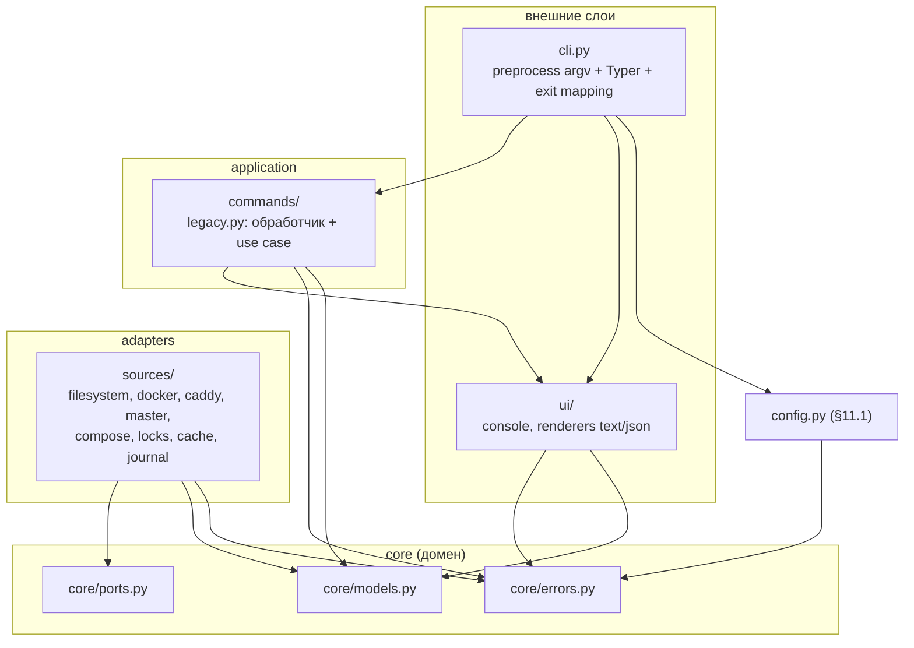
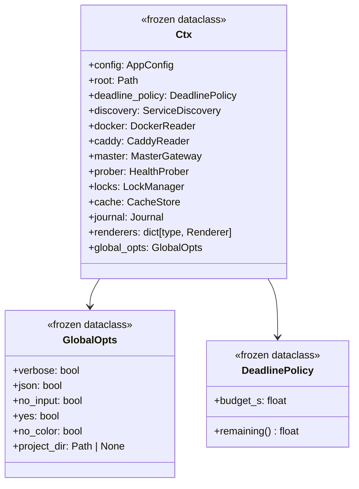
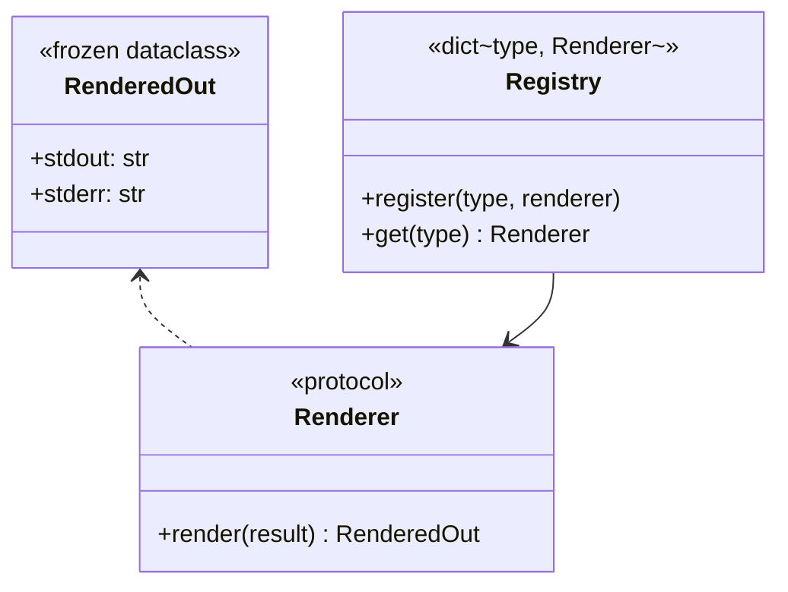
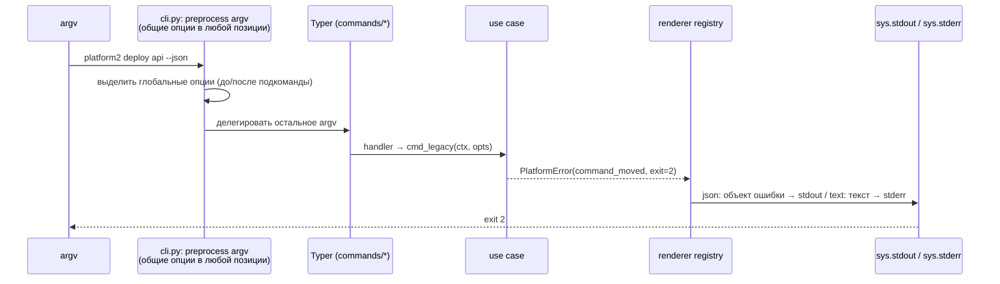
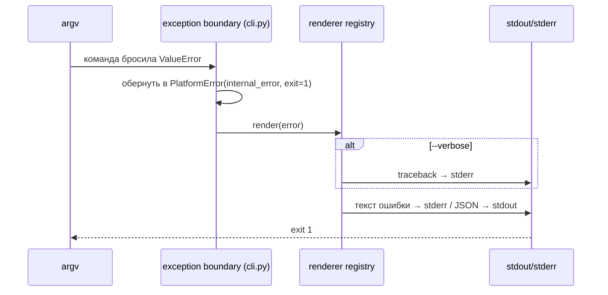

# Tech Spec: platform-cli P1 «Каркас»

- **Фаза**: P1 по §18.1 спеки `_core/platform-cli/docs/platform-cli-v2-spec.md` (rev 1.2)
- **Источники решений**: ADR-001 (runtime), ADR-002 (Ctx + ports), ADR-003 (results/presenters/errors)
- **Скоуп**: только P1. P2+ — отдельные подпланы после интеграции P1.
- **Бэклог**: `01_backlog_p1_scaffold.md` (это отдельный документ)

Критерий выхода фазы (§18.1): CLI-тесты — help, exit codes, stdout/stderr,
TTY/non-TTY, `--json`-ошибки. Точка входа — `platform2` в бранше `platform-cli-v2`.

---

## 1. Механика v1 ↔ v2 (решение оператора 2026-10-06)

**Composition root — сразу `apps_platform/cli.py`** (без переходного
`cli_v2.py`): бранш изолирован, параллельная работоспособность v1 в бранше
не является требованием («ничего не сломается»).

- **T0 (выполнено)**: v1 `apps_platform/cli.py` → `apps_platform/legacy_cli.py`
  (git mv); импорты v1-команд/`api_client`/тестов переключены на `legacy_cli`
  (патчи `apps_platform.legacy_cli.<helper>`); entry
  `platform = apps_platform.legacy_cli:main` (v1 остаётся запускаемым).
- v2 composition root — **новый `apps_platform/cli.py`** (T8), entry
  `platform2 = apps_platform.cli:main`; в P7 `legacy_cli` + v1-команды
  удаляются, `platform2` → `platform`.
- Логика v1-адаптеров в P1 **не переносится**, а оборачивается: `sources/*`
  — тонкие обёртки над существующими модулями (`service_inspection`,
  `caddy_parser`, `api_client`, хелперы `legacy_cli.py`), конвертирующие
  `typer.Exit`/print в `PlatformError`. Полный перенос §10.5 — по мере фаз
  (docker/caddy/master — P2, locks/compose — P3, журналирование — P4).
- v1-имена в `legacy_cli.py` (`get_project_root`, `get_config`,
  `platform_lock`, …) сохраняются как делегаты/ре-экспорты до P7 — v1-команды
  и v1-тесты продолжают работать. v2-код **не импортирует** ничего из
  `legacy_cli.py`.

## 2. Структура модулей P1 (слои по §10.1)



Направление зависимостей: стрелка = «зависит от». Domain (`core`) не зависит
ни от чего; Typer/Rich/docker — только в `cli.py`, `ui`, `sources`, `commands`.

## 3. Ctx — composition root (ADR-002)



- `Ctx` собирается **один раз** в `cli.py` при старте команды; дальше
  передаётся явно в каждый use case (`cmd_x(ctx, opts) -> Result`).
- `DeadlinePolicy` — скелет по ADR-001: в P1 объявляется (бюджет default 2s,
  §8.2), реально применяется с P2 (use case `status`).
- Тесты конструируют `Ctx` напрямую с fake-адаптерами; subprocess-тесты идут
  через entry `platform2`.

## 4. Порты (8, закрытый список — ADR-002)

| Порт (Protocol) | Адаптер в P1 | Сигнатуры P1 | Наполняется |
|---|---|---|---|
| `ServiceDiscovery` | `sources/filesystem.py` — обёртка над `cli.get_services()` + резолвинг корня | `list_services() -> list[ServiceRef]` | P2 (структурированный возврат, §10.5) |
| `DockerReader` | `sources/docker.py` — обёртка над `service_inspection` / `docker.from_env` | объявлен, методы — пустая заготовка | P2 (статусы, inspect), P4 (stats, logs) |
| `CaddyReader` | `sources/caddy.py` — обёртка над `caddy_parser` | объявлен, пустая заготовка | P2 |
| `MasterGateway` | `sources/master.py` — обёртка над `api_client` (aiohttp остаётся до P2) | объявлен, пустая заготовка | P2 (деградация, rewrite → requests, §18.1 P2) |
| `HealthProber` | `sources/probe.py` | объявлен, пустая заготовка | P2 (стратегия Q6) |
| `LockManager` | `sources/locks.py` — обёртка над `cli.platform_lock()` | объявлен, пустая заготовка | P3 (scoped locks, §13.4) |
| `CacheStore` | `sources/cache.py` | объявлен, пустая заготовка | P5 (completion snapshots, §14) |
| `Journal` | `sources/journal.py` | объявлен, пустая заготовка | P4 (журнал операций, §13.5) |

Правило: **список портов закрыт**; новые методы добавляются в существующий
порт при появлении use case (§10.2 — порт только на реальной границе).

## 5. Контракт результат → рендер → ошибка (ADR-003)



- Рендереры: `ui/renderers/text.py`, `ui/renderers/json.py`. Чистые функции
  `render(result) -> RenderedOut`. Диспетчеризация — реестр по **типу
  результата**, реестр собирается в composition root; отсутствие рендерера =
  AssertionError при сборке, не в рантайме пользователя.
- JSON: обёртка `{"schema_version": 1, ...}`; каждая команда контролирует
  схему через явный `to_json()` на результате.
- NDJSON-рендерер в P1 **не создаётся** (нужен с P4: `logs --follow --json`).
- Печатает **только** CLI-адаптер: `stdout` рендерера → sys.stdout,
  `stderr` → sys.stderr. Use cases и рендереры не делают print.

### Ошибки (§12.3, §12.4)

`PlatformError(code, exit_code, message, object, hint, cause)` в
`core/errors.py`:

| Поле | Назначение |
|---|---|
| `code` | значение из закрытого реестра (константы в `errors.py`) |
| `exit_code` | берётся из реестра, не задаётся вызывающим |
| `message` | человеческий текст, отвечает на 4 вопроса §12.3 (русский) |
| `object` | затронутый объект (сервис, путь, шаг) — попадает в JSON |
| `hint` | шаблон из реестра §12.4 |
| `cause` | исходное исключение (для `--verbose`) |

Реестр — таблица `code → exit → hint` из §12.4, как неизменяемая константа.
Unexpected-исключение → `internal_error` (exit 1), traceback только при
`--verbose`. Ctrl-C → `cancelled` (exit 130), ничего не изменено.

**Дополнение реестра в P1**: §7.5 требует exit 2 для заглушек старых команд,
но отдельного `code` в таблице §12.4 нет. Фиксируется `command_moved` →
exit 2 (правка спеки §12.4, rev 1.3, при реализации задачи T7).

Exit codes (единственный владелец — §12.4): `0` успех, `1` ошибка операции,
`2` аргументы/конфигурация, `3` обязательная зависимость, `4` findings
`diag`, `130` Ctrl-C.

### Маршрутизация вывода (§12.1, §12.2)

| Канал | Содержимое |
|---|---|
| stdout | данные/JSON-успех; JSON-ошибка (объект с `schema_version`) |
| stderr | человеко-текст ошибок, warnings, прогресс, prompt'ы |
| stdout при non-TTY | без цвета/анимации, построчный вывод |
| `NO_COLOR`, `TERM=dumb`, `--no-color` | независимо от канала, уважаются каждым рендерером |

## 6. Последовательности P1





## 7. Конфигурация и окружение (§11.1)

**Project root** (первый найденный выигрывает):
`--project-dir PATH` → env `OPS_PROJECT_ROOT` → маркер `.ops-root` вверх от
CWD → `project_root` из системного конфига → CWD.

**Приоритет настроек**: CLI-флаг > env > user config
(`~/.config/platform/config.yml`, только preferences) > `.ops-config.yml`
проекта (source of truth).

**Env-переменные** (полный набор P1):

| Переменная | Назначение | P1 |
|---|---|---|
| `OPS_PROJECT_ROOT` | явный project root | да |
| `OPS_CONFIG_PATH` | путь к ops-конфигу | да |
| `PLATFORM_API_TOKEN` | Bearer Master API (только env) | читается, не используется до P2 |
| `PLATFORM_ENV` | `production` → TLS verify принудительно | да (политика в config) |
| `PLATFORM_SSL_VERIFY` | `false` → отключить verify вне production | да |
| `NO_COLOR`, `TERM` | отключение цветов | да |
| `XDG_CONFIG_HOME`, `XDG_CACHE_HOME`, `XDG_RUNTIME_DIR` | стандартные пути | да (user config, кэш P5, lock P3) |

`Master URL` — `master_url` из `.ops-config.yml`, дефолт
`http://localhost:8001`. Отсутствующий конфиг → `config_not_found` (exit 3).

**User config** (`§8.2`): `status.sections`, `status.compact`,
`status.deadline`, `health.stale_after` — schema объявляется в P1
(frozen `AppConfig`), наполняется/читается в P2.

## 8. Миграция §10.5 — что делаем в P1

| Объект | Действие в P1 |
|---|---|
| `legacy_cli.py` (бывш. `cli.py`, T0): `get_project_root()`, `get_config()` | логика переезжает в `config.py` (без правок поведения); в `legacy_cli.py` — делегаты до P7 |
| `legacy_cli.py`: `get_services()` | обёртка `sources/filesystem.py` → `ServiceRef`; v1-функция не трогается |
| `legacy_cli.py`: `platform_lock()` | обёртка `sources/locks.py` (сигнатура порта); логика не переносится |
| `legacy_cli.py`: `compose_cmd()`, `get_service_status()` | обёртки `sources/compose.py`, `sources/docker.py`; логика не переносится |
| `service_inspection.py`, `caddy_parser.py` | парсеры остаются; `sources/*` оборачивают (pure/IO разделение — P2) |
| `api_client.py` | обёртка `sources/master.py`; rewrite на requests — P2 (импорт `from .legacy_cli` — T0) |
| `commands/services*.py`, `backups.py` | не трогаем (v1; импорты на `legacy_cli` — T0); v2-команды появляются с P2 |
| `scripts/validate.py` | не трогаем (перенос — P2/P5) |
| `tests/test_cli.py`, `test_config.py` | привести в соответствие с делегатами config; импорты/патчи на `legacy_cli` (T0); **патчи `apps_platform.cli.<helper>` в новых тестах запрещены** |

## 9. Файловая структура P1

**Новые**:

```text
apps_platform/
├── cli.py                   # НОВЫЙ: composition root + Ctx + exception boundary + main()
├── legacy_cli.py            # бывший cli.py (T0): v1, заморожен до P7
├── core/
│   ├── __init__.py
│   ├── models.py             # ServiceRef, enums, Observation, Finding, FixSuggestion, Deadline
│   ├── errors.py             # PlatformError + закрытый реестр §12.4
│   └── ports.py              # 8 Protocols
├── sources/
│   ├── __init__.py
│   ├── filesystem.py         # ServiceDiscovery (обёртка)
│   ├── docker.py             # DockerReader (скелет)
│   ├── caddy.py              # CaddyReader (скелет)
│   ├── master.py             # MasterGateway (скелет-обёртка)
│   ├── probe.py              # HealthProber (скелет)
│   ├── compose.py            # обёртка compose_cmd
│   ├── locks.py              # LockManager (обёртка)
│   ├── cache.py              # CacheStore (скелет)
│   └── journal.py            # Journal (скелет)
├── ui/
│   ├── __init__.py
│   ├── console.py            # Console, NO_COLOR/TTY-политика
│   └── renderers/
│       ├── __init__.py       # реестр
│       ├── text.py
│       └── json.py
└── commands/
    └── legacy.py             # заглушки §7.5 (v2)
tests/
├── test_errors.py
├── test_models.py
├── test_renderers.py
├── test_config_v2.py
├── test_ports.py             # fake-адаптеры собираются в Ctx
└── test_cli_v2.py            # subprocess: help, exit codes, TTY/non-TTY, --json
```

**Изменённые**: `pyproject.toml` (entries `platform` → `legacy_cli` (T0),
`platform2` → `apps_platform.cli:main` (T8)),
`apps_platform/config.py` (перенос логики root/config по §11.1),
`apps_platform/legacy_cli.py` (делегаты config — минимально),
`tests/test_config.py` (под делегаты).
Импорты v1-слоя на `legacy_cli` (commands/*, api_client, tests/test_cli.py) —
сделаны в T0.

**Не трогаем в P1**: `service_inspection.py`, `caddy_parser.py`,
`api_client.py`, `commands/services*.py`, `commands/backups.py`,
`scripts/validate.py`, README (обновляется в P7).

**pyproject**: `[project.scripts] platform2 = "apps_platform.cli:main"`.
Зависимости P1 без изменений: `aiohttp` остаётся (уходит в P2 вместе с
rewrite master), `questionary` добавляется в P3 (wizard §13.3).

## 10. Принципы, которые developer не должен нарушать

1. **Синхронность**: никакого asyncio в ядре/use cases (ADR-001). Параллелизм —
   только `ThreadPoolExecutor` внутри use cases (появится в P2).
2. **Зависимости только в сторону домена**: `core/` не импортирует Typer,
   Rich, docker SDK, HTTP-клиент, файловый слой; domain не запускает процессы.
3. **Никакого вывода вне CLI-адаптера**: use cases возвращают результаты,
   рендереры возвращают `RenderedOut`; `print`/`console.print` в `core/`,
   `commands/`, рендерах запрещены (кроме `cli.py` при финальном выводе).
4. **Ошибки только через `core/errors.py`**: exit-код берётся из реестра;
   нельзя задавать `exit_code` вручную, нельзя `typer.Exit` вне `cli.py`.
5. **Глобальный mutable state запрещён**; `lru_cache` — только для
   неизменяемых snapshot'ов внутри одного вызова; `Ctx` — frozen.
6. **Патчи внутренних имён v2 запрещены**: тесты подменяют порты через
   конструктор `Ctx`, не `monkeypatch("apps_platform.cli.<helper>")`.
7. **JSON — только в stdout**, всегда объект с `schema_version`; ошибки в
   `--json` — тоже объект в stdout; человеческий текст — stderr.
8. **Список из 8 портов закрыт**; новый порт — только через ADR-ревью.
9. **Реестр кодов ошибок закрыт**: новые code — только по §12.4-процедуре
   (ADR-ревью, правка спеки).
10. **v1-код заморожен**: не рефакторировать `legacy_cli.py`/v1-команды сверх
    делегатов config; не импортировать v2 из v1 и наоборот (кроме делегатов).
11. **Русский текст — человеку, английский — машинным полям** (§7.6).

## 11. Допущения и открытые детали P1

1. ~~`command_moved` — новый code~~ **Решено**: добавлен в §12.4 спеки,
   ревизия 1.3 (выполнено 2026-10-06); code `command_moved`, exit 2,
   hint «platform --help; заглушки будут удалены в v2.1».
2. ~~Имя переходного модуля `cli_v2.py`~~ **Решено оператором**: composition
   root — сразу `cli.py`; v1 переименован в `legacy_cli.py` (T0 выполнен).
3. Сигнатуры пустых заготовок портов (docker/caddy/master/prober/…) —
   объявляются minimal (`...`), наполняются в P2–P4; это не архитектурное
   изменение (список портов не растёт).
4. `DeadlinePolicy` в P1 — только тип/скелет, без применения (use cases нет).
5. Baseline v1-тестов — 25 прекестовых падений (патч ClientSession в
   `test_api_client` ×14; коллайдер `backup`/`backup create` + `129_chars`
   в `test_cli` ×11). В P1 не чинятся (v1 заморожен, удаляется в P7);
   критерий T11 — «не хуже baseline», новых падений 0.

## 12. Не входит в P1 (границы подплана)

- `status`, `service list/info` и любые data-команды (P2)
- Master rewrite на requests, деградация, freshness (P2)
- Locks scoped, wizard, confirmations, `--watch` (P3–P4)
- Completion, кэш, diag server (P5–P6)
- Удаление v1-слоя, README, wheel parity (P7)
- Textual dashboard (вне спеки, P7+)
