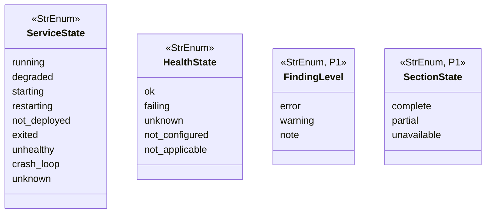
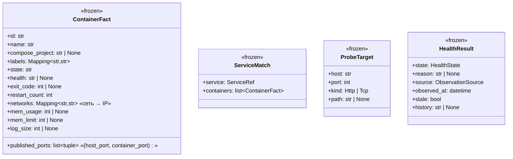
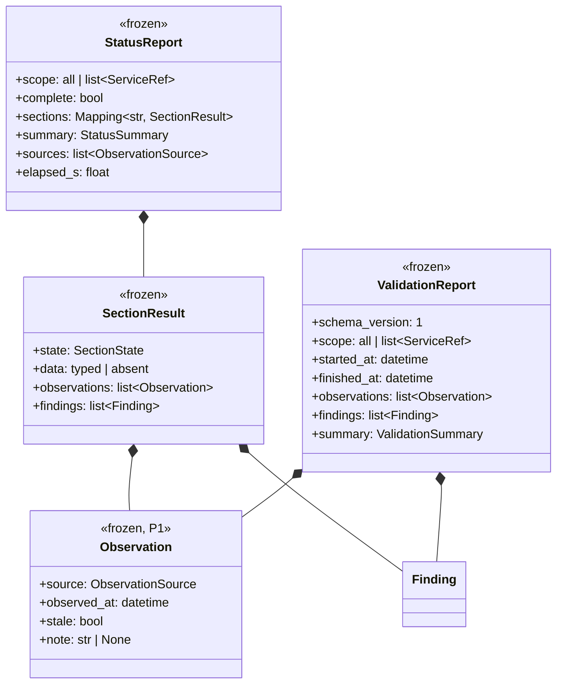
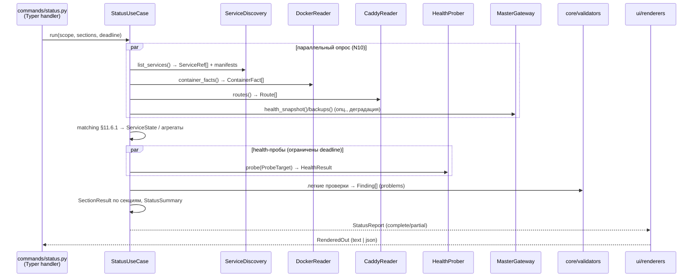
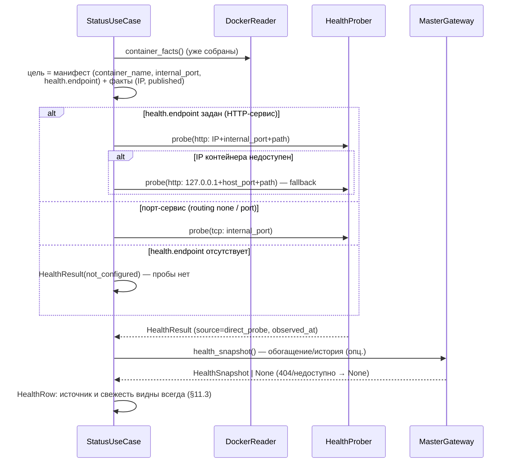
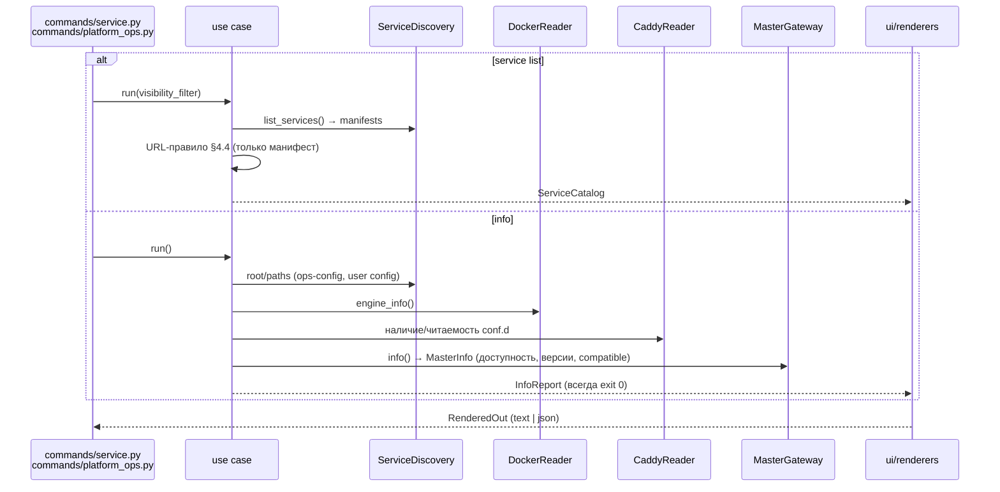
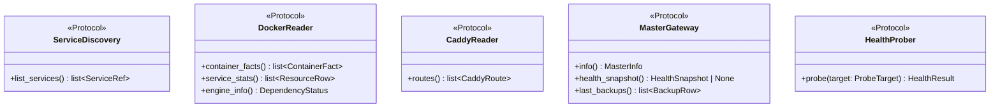
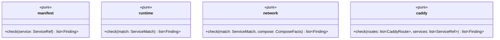

# Tech Spec: platform-cli P2 «Наблюдение»

- **Фаза**: P2 по §18.1 спеки `_core/platform-cli/docs/platform-cli-v2-spec.md` (rev 1.3)
- **Источники решений**: спека §7.2, §7.4, §8, §9.1, §10.4–§10.5, §11.1–§11.6, §12.1–§12.4, §15.1–§15.2, §17.1, Приложения C–F; ADR-001…003; tech spec P1 (`01_tech_spec_p1_scaffold.md`)
- **Скоуп**: только P2. P3+ — отдельные подпланы после интеграции P2.
- **Бэклог**: `02_backlog_p2_observation.md` (это отдельный документ)
- **Вход фазы**: P1 закрыт (composition root, error mapping, presenters text/json, config/env, порты, заглушки старых команд, опции в любой позиции).

Критерии выхода фазы (§18.1): Deadline, freshness/provenance, JSON-схемы,
матрица §11.2 покрыта тестами; регрессии багов v1 не воспроизводятся
(§11.6.3). Точка входа в бранше — `platform2` (в P7 переезжает как
`platform`); в примерах ниже команды пишутся как `platform2`.

---

## 1. Скоуп P2

| # | Что строим | Владелец в спеке |
|---|---|---|
| 1 | `platform2 status [SERVICE]` — секции, SectionResult, partial/`--strict`, дедлайн | §8, §9.1, §17.1 |
| 2 | `platform2 service list` — офлайн-каталог по манифестам | §7.2 |
| 3 | `platform2 info` — единственная сводка окружения/зависимостей | §7.2, F14 |
| 4 | Лёгкие read-only валидаторы → секция `problems` (manifest, caddy, network, runtime) | §15.1 |
| 5 | Master-клиент с деградацией (requests), обогащение health, секция `backups` | §8.1, §11.2, §11.6.4 |
| 6 | Прямая health-проба (Q6), свежесть/provenance (Observation) | §8.1, §11.3, §17.2 |
| 7 | Сопоставление контейнер ↔ сервис (§11.6.1), агрегатные статусы (Прил. D) | §11.6.1, Прил. D |
| 8 | JSON-схемы трёх команд (schema_version 1), golden-вывод 60/80/120 | §12.1, §12.2, §18.2 |
| 9 | Матрица деградации §11.2 (команды P2) — тестами; регрессии §11.6.3 | §11.2, §11.6.3 |

**Не входит в P2** — см. §16.

## 2. Толкования спеки (конфликты и пробелы — решено для P2)

Правило чтения спеки: «каждое правило имеет один раздел-владелец».
Ниже — владельцы и снятые двусмысленности.

1. **C1 (Прил. C) ↔ §8.1/Q2 — health при недоступном Master.**
   C1 требует `health: unavailable` при мёртвом Master; §8.1 и Q2 (rev 1.2,
   позднее C1) устанавливают primary — **прямая проба**, Master — только
   обогащение. Владелец правила — §8.1. **Решение**: при недоступном Master
   health-секция собирается прямыми пробами (partial, если пробы невозможны);
   `unavailable` — только когда данных нет ни от одного источника секции.
   Приёмка C1 читается как «health без обогащения Master», backups —
   unavailable. Правка текста C1 — задача документации фазы (не блокер).
2. **`--strict` (§8.3).** exit 3 строго при недоступности секции
   (`state: unavailable`) хотя бы одной запрошенной секции. `partial` даже под
   `--strict` — exit 0; полный контроль полноты — `complete: false` в JSON
   (§8.3: «--strict и/или --json + проверка complete»).
3. **Прогрессивный вывод (§17.1) ↔ канонический экран (§9.1).** Сбор —
   параллельный с общим deadline (жёстко). Печать: TTY — секции по мере
   готовности в каноническом порядке, финальная страница (с шапкой-итогом
   §9.1) отрисовывается целиком (Rich Live); non-TTY и `--json` — batch
   одним блоком (построчно, без перерисовки, §12.1). Golden-снапшоты пишутся
   на batch-рендере (детерминизм).
4. **strict ≠ полнота** — см. п.2; CI-мониторинг полноты — JSON `complete`.
5. **URL-колонка только из манифеста** (§7.2 «URL из манифеста»). Caddy не
   участвует в вычислении URL — это закрывает регрессии §11.6.3² (URL-мусор,
   межсервисная утечка парсера) структурно. Caddy участвует только в
   проверках `problems`.
6. **`routing: port`** — в колонке URL нет URL: выводится `порт <port>`; URL
   не выдумывается (§5.8, регрессия §11.6.3⁴: `http://localhost:8000` — мусор).
7. **Колонки без источника не выводятся** (§5.8; регрессии §11.6.3⁵⁻⁶:
   память одного контейнера, `Available: ?`).

## 3. Модель данных

Новых хранилищ в P2 нет (ERD неприменим; кэш снапшотов — P5). Всё — frozen
dataclass / закрытые enum'ы в `core/models.py` (расширение P1) и чистые
функции `core/`.

### 3.1 Статусные enum'ы (Приложение D, машинные значения)



Нормализация машинных значений (в JSON — ровно эти строки):

| Значение | Маркер (Прил. D) | Текст-дубль | Цвет |
|---|---|---|---|
| `running` | `●` | running | green |
| `degraded` | `◐` | degraded | yellow |
| `starting` | `◔` | starting | yellow |
| `restarting` | `◔` | restarting | yellow |
| `not_deployed` | `◇` | not deployed | dim |
| `exited` | `○` | exited | red |
| `unhealthy` | `✳` | unhealthy | red |
| `crash_loop` | `✳` | crash-loop | red |
| `unknown` | `?` | unknown: `<причина>` | dim |

Маркер/цвет/человеческий текст — таблица соответствия в `ui/` (presentation),
машинные значения — только в `core`. `unknown` **всегда** несёт причину
(§5.2).

Health (Прил. D): `ok | failing | unknown | not_configured | not_applicable`;
`unknown` несёт `reason`; `not_configured` — факт конфигурации (нет
`health.endpoint`); `not_applicable` — порт-сервис, TCP-проверка пройдена.

### 3.2 Факты источников и сопоставление



`ServiceRef` (P1) расширяется полным манифестом (Приложение B):
`RoutingEntry(type, domain, base_domain, path, port, internal_port,
container_name, auto_subdomain)`, `ServiceManifest(name, visibility, routing:
tuple[RoutingEntry, ...] | None, routing_none: bool, health_endpoint: str |
None, backup_enabled: bool | None)`. `routing=None` — поле забыто (warning);
`routing_none=True` — осознанное `routing: none` (note).

### 3.3 Секции и отчёты (§10.4 дословно)



- `Finding`, `FixSuggestion` — уже в P1, без изменений полей (§10.4).
- Отдельного поля `warnings` нет — предупреждения это `Finding(level=warning)`.
- `ValidationSummary`: `errors, warnings, notes, services_ok,
  services_with_findings`.
- `StatusSummary`: `services_total, services_running, attention, problems`.

Типы `data` секций (все frozen):

| Секция | `data` | Источники (Observation) | Бюджет (§8.1) |
|---|---|---|---|
| `services` | `list[ServiceStatusRow]` | filesystem, docker | дешёвая |
| `health` | `list[HealthRow]` | direct_probe, master | средняя |
| `problems` | `list[Finding]` | filesystem, docker, caddy | дешёвая |
| `resources` | `list[ResourceRow]` | docker | дорогая — только по запросу |
| `backups` | `list[BackupRow]` | master | дешёвая |

- `ServiceStatusRow`: service, visibility, state: `ServiceState`, url:
  `str | None`, routing_label: `str`, containers: `list[ContainerRef]`
  (name, state, health, restart_count).
- `HealthRow`: service, result: `HealthResult` (source/observed_at/stale/
  history всегда видны — §5.2, §11.3).
- `ResourceRow`: service, container, mem_usage, mem_limit, log_size,
  cpu_pct?, disk? — **поля без источника отсутствуют**, колонка не рисуется
  (§5.8, регрессии ⁵⁻⁶).
- `BackupRow`: service, snapshot_id?, created_at?, age_s?, size? — из Master;
  без Master — `data` отсутствует, секция `unavailable`.

Отчёты команд:

- `ServiceCatalog` (list): `source: "filesystem"`, `observed_at`, `entries:
  list[CatalogEntry]`; `CatalogEntry`: name, visibility, routing_label, url:
  `str | None`, path (каталог сервиса), manifest_path, routes:
  `list[RoutingEntry]`.
- `InfoReport` (info): cli_version, project_root, project_root_source
  (`flag|env|marker|config|cwd`), paths {ops_config, user_config, cache_dir,
  locks_dir}, dependencies `list[DependencyStatus]` (name, version?,
  available: bool, note?), environment {no_color, term, platform_env,
  ssl_verify, containerized: bool}.

### 3.4 Реестр проверок (для `problems` и будущего `diag validate`)

Стоимость — свойство проверки (реестр `core/validators`), модель `Finding`
не растёт; в JSON рядом с `check` отражается `cost`.

| check-id | Уровень | cost | Источник данных | FixSuggestion |
|---|---|---|---|---|
| `manifest/missing` | error | cheap | filesystem | — |
| `manifest/invalid-yaml` | error | cheap | filesystem | — |
| `manifest/name-mismatch` | error | cheap | filesystem | — |
| `manifest/visibility-dir` | error | cheap | filesystem | два варианта: `mv` каталога (`risky: true`) / смена visibility |
| `manifest/routing` (поле отсутствует) | warning | cheap | filesystem | «задайте routing: none, если сервис без HTTP-роутинга» |
| `manifest/routing` (`routing: none`) | note | cheap | filesystem | — (норма) |
| `manifest/routing-entry` | error | cheap | filesystem | заполнить `container_name`/`internal_port` |
| `manifest/health-endpoint` | warning | cheap | filesystem | структура `health.endpoint` |
| `runtime/running` | error | cheap | docker (один батч inspect) | запустить сервис |
| `runtime/unhealthy` | warning | cheap | docker | `platform2 service logs <svc>` (текст подсказки) |
| `network/external` | error | cheap | docker-compose сервиса | `platform_network: external: true` (корневая причина) + `docker network connect` (`risky: true`, временное) |
| `network/membership` | error | cheap | docker | то же |
| `caddy/duplicate-domain` | error | cheap | caddy | — |
| `caddy/orphan-route` | warning | cheap | caddy | маршрут без бэкенда |
| `platform/labels` | note | cheap | docker | метки `platform.*` отсутствуют (§11.6.2 — note, не error) |

Секция `problems` в status — **строгое подмножество** (§15.1): `manifest/*`
(файлы, уже прочитаны discovery), `caddy/duplicate-domain` + `caddy/orphan-route`
(файлы), `network/membership` и `runtime/running` (один батч docker inspect
из уже собранных фактов). Никаких HTTP-проб и `runtime/unhealthy` в
`problems` — это P5 (`diag validate`) / секция `health` соответственно.

## 4. Алгоритмы (чистый домен)

### 4.1 Сопоставление контейнер ↔ сервис (§11.6.1) — `core/matching.py`

Вход: `list[ContainerFact]` + `list[ServiceRef]`. Выход: `list[ServiceMatch]`
+ список несопоставленных контейнеров (не показываются как сервисы).

1. **Primary**: `com.docker.compose.project == <имя сервиса>`.
2. **Secondary**: метка `platform.service == <имя сервиса>`.
3. **Fallback**: эвристика имён v1 (`_matches_service`): нормализация дефисов/
   подчёркиваний, отбрасывание суффикса индекса (`-1`), префиксов compose
   (`support-zammad-web`). Покрывает `urfu_forms_backend`,
   `course-archive-explorer-frontend-1`, `support-zammad-web` (§11.6.1).

Правила: контейнер принадлежит **не более чем одному** сервису; шаг 1
приоритетнее шага 2, шаг 2 — шага 3; контейнер, сопоставленный на более
раннем шаге, не переназначается. Несопоставленные контейнеры — в
`ServiceMatch` не попадают (и не превращаются в сервисы).

### 4.2 Агрегация `ServiceState` (Прил. D)

По контейнерам сервиса (в порядке приоритета, первое совпадение):

| Условие | Состояние |
|---|---|
| контейнеров нет (сервис на диске) | `not_deployed` |
| любой контейнер: `restart_count ≥ 5` (константа `CRASH_LOOP_RESTARTS`) | `crash_loop` |
| любой контейнер: health == `unhealthy` | `unhealthy` |
| любой контейнер: state == `restarting` | `restarting` |
| любой контейнер: health == `starting` | `starting` |
| все контейнеры state == `exited`/`created` | `exited` |
| часть запущена, часть нет | `degraded` |
| все `running` | `running` |
| иначе / состояние неизвестно | `unknown` (+ причина) |

Формула «требует внимания» (§8.3): сервис — внимание, если health =
`failing`, ИЛИ его состояние ∈ {`exited`, `unhealthy`, `crash_loop`}, ИЛИ в
`problems` есть error-finding по этому сервису. Шапка: `N из M сервисов
работают, K требуют внимания`, где N = `running`, M = все сервисы scope.

### 4.3 Прямая health-проба (Q6, §17.2) — `sources/probe.py`

1. Цель из манифеста + фактов Docker: `routing`-запись (container_name,
   internal_port) → `ProbeTarget`.
2. **Primary**: IP контейнера (из `ContainerFact.networks`) + `internal_port`.
3. **Fallback**: published port (`host_port`) → `127.0.0.1:<host_port>`.
4. HTTP-сервис с `health.endpoint`: `GET <path>` → 2xx → `ok`; иначе
   (код, timeout, refused) → `failing` (reason: код/причина).
5. Порт-сервис (`routing: none` или запись типа `port`): TCP-connect к
   `internal_port`; успех → `not_applicable`; отказ → `failing`.
6. HTTP-сервис без `health.endpoint` → `not_configured` (пробы нет).
7. Сервис `not_deployed` → `unknown` с причиной «сервис не задеплоен».
8. Docker недоступен → `unknown` с причиной «Docker недоступен» (для
   сервисов с пробой); `not_configured` остаётся фактом конфигурации.

Таймаут пробы — `min(2s, остаток deadline)`. Пробы — параллельно
(ThreadPoolExecutor, N10); по истечении общего deadline незавершённые →
`unknown` с причиной «дедлайн исчерпан», секция `health` — `partial`.

**Обогащение Master (§8.1, §11.6.4)**: `health-snapshot` — заглушка; при
404/отсутствии роута обогащение и история («падает 12 мин») просто
отсутствуют, `Observation(master)` фиксирует это. История **никогда** не
показывается без источника (§5.8). Кэшированные данные Master не выдаются
за пробу: источник и `stale` (порог `health.stale_after`, 90с) — в
`Observation` всегда (§11.3).

### 4.4 URL-правило каталога/status (регрессии ², ⁴)

URL вычисляется **только из манифеста**, никогда из caddy/докера:

| routing манифеста | Колонка URL |
|---|---|
| запись `domain` | `https://<domain>` |
| запись `subfolder` | `https://<base_domain><path>` (path по умолчанию `/<name>`) |
| запись `port` | `порт <port>` (URL отсутствует) |
| `routing: none` | `(порт-сервис, HTTP-роутинга нет)` (URL отсутствует) |
| поле `routing` забыто | URL отсутствует + warning `manifest/routing` в problems |

Несколько routing-записей — колонка по первой записи, полный список в JSON
(`routes[]`).

### 4.5 Сбор status (deadline, partial)



Правила: дедлайн — **общий на команду** (не сумма timeout'ов);
незавершённые секции — `partial`/`unavailable` с `Observation`-причиной;
отказ опционального источника не маскируется под успех и не блокирует
остальные секции (§11.2); ФС обязательна → отказ = `config_not_found`,
exit 3.

### 4.6 Проба одного сервиса (pipeline health)



### 4.7 Каталог и info (read-only, без дедлайна)



## 5. Интерфейсы модулей

### 5.1 Порты (закрытый список ADR-002 — наполнение P2)



Порты `LockManager`, `CacheStore`, `Journal` — не трогаются (P3–P5).
Список портов закрыт: новых нет, только сигнатуры существующих. Адаптеры —
`sources/*`; тесты подменяют порты через `Ctx` (принцип P1 №6).

`CaddyRoute`, `MasterInfo`, `HealthSnapshot` — frozen-типы моделей
(`core/models.py`): `CaddyRoute(domain, path, upstream, source_file)`;
`MasterInfo(available: bool, version?, api_version?, compatible: bool|None,
note?)`; `HealthSnapshot` — обёртка данных обогащения (история, соответствие
probe), при заглушке §11.6.4 — `None`.

### 5.2 Use cases и команды

| Use case | Файл команды | Вход | Выход | Контракт |
|---|---|---|---|---|
| `StatusUseCase` | `commands/status.py` | scope, sections, deadline, strict | `StatusReport` | §8 целиком |
| `ListServicesUseCase` | `commands/service.py` | visibility-фильтр | `ServiceCatalog` | §7.2 «офлайн-каталог» |
| `InfoUseCase` | `commands/platform_ops.py` | — | `InfoReport` | F14, всегда exit 0 |

Пара «Typer-обработчик (тонкий) + use case» в одном файле (§10.2);
обработчик не содержит правил. `--watch` — P4 (в P2 опция не регистрируется).

### 5.3 Валидаторы (`core/validators/`)



Чистые функции: на входе уже собранные факты, на выходе `Finding[]`
(с `FixSuggestion`, команды — argv-массивами, пути от project root,
`risky`-флаги — §9.4). I/O в валидаторах запрещён. Стоимость проверок —
реестр `core/validators/__init__.py` (check-id → level/cost).

## 6. Поверхность команд P2

Общие опции (все команды, любая позиция — уже в P1): `--verbose`, `--json`,
`--no-input`, `--yes`, `--no-color`, `--project-dir PATH`.

| Команда | Позиционные | Специфичные опции | Результат (text / `--json`) | Exit |
|---|---|---|---|---|
| `platform2 status [SERVICE]` | SERVICE опц. | `--sections LIST`, `--strict` | экран §9.1 / `StatusReport` | 0 (partial допустим); 2 (`section_unknown`, `service_not_found`, `invalid_value`); 3 (ФС недоступна; `--strict` + unavailable-секция); 130 (Ctrl-C) |
| `platform2 service list` | — | `--visibility {public,internal,core}` | каталог / `ServiceCatalog` | 0; 3 (ФС) |
| `platform2 info` | — | — | сводка окружения / `InfoReport` | **всегда 0** (§11.2) |

- `platform2 status` без аргументов — обзор платформы, **никогда не
  prompt'ит** (§5.1). `platform2 status <service>` — один сервис, компактный
  экран (`api: ● running, health ✔ ok, проверено только что` — §4).
- Неизвестная секция в `--sections` → exit 2 `section_unknown` (hint —
  допустимые значения); в конфиге — warning и игнор (уже P1).
- `service_not_found` (status по имени) → exit 2, hint `platform2 service list --json`.
- `--sections` — список через запятую; порядок печати всегда канонический
  (`services, health, problems, resources, backups`).

## 7. JSON-схемы (schema_version 1, §12.2)

Корень — объект; top-level массив запрещён; успешный `--json` — только JSON
в stdout; human-прогресс/warnings — stderr; JSON-ошибка — объект в stdout.

```jsonc
// platform2 service list --json
{
  "schema_version": 1,
  "source": "filesystem",
  "observed_at": "2026-10-07T12:00:00Z",
  "services": [
    {"name": "api", "visibility": "public", "routing": "domain",
     "url": "https://api.example.test", "path": "services/public/api",
     "routes": [{"type": "domain", "domain": "api.example.test",
                 "internal_port": 8000, "container_name": "api-web"}]}
  ]
}
```

```jsonc
// platform2 status --json  (partial: Master недоступен — пример §12.2 + расширения)
{
  "schema_version": 1,
  "scope": "all",
  "complete": false,
  "sources": ["filesystem", "docker", "caddy", "direct_probe"],
  "elapsed_s": 1.4,
  "sections": {
    "services": {"state": "complete", "data": [/* ServiceStatusRow[] */]},
    "health":   {"state": "complete",
                 "data": [/* HealthRow[] */],
                 "observations": [{"source": "master", "stale": false,
                                   "note": "health-snapshot недоступен, обогащения нет"}]},
    "backups":  {"state": "unavailable",
                 "observations": [{"source": "master", "note": "connection refused"}]}
  },
  "summary": {"services_total": 9, "services_running": 8,
              "attention": 2, "problems": 2}
}
```

```jsonc
// platform2 info --json
{
  "schema_version": 1,
  "cli_version": "2.0.0.dev",
  "project_root": "/apps",
  "project_root_source": "marker",
  "paths": {"ops_config": "/apps/.ops-config.yml",
            "user_config": "~/.config/platform/config.yml",
            "cache_dir": "~/.cache/platform", "locks_dir": "/apps/.platform-locks"},
  "dependencies": [
    {"name": "docker", "version": "5.0.0", "available": true},
    {"name": "caddy", "version": "2.11.2", "available": true},
    {"name": "master", "version": null, "available": false,
     "note": "connection refused"}
  ],
  "environment": {"no_color": false, "term": "xterm", "platform_env": null,
                  "ssl_verify": true, "containerized": false}
}
```

JSON `ValidationReport` (секция problems / будущий `diag validate`) —
структура §10.4 дословно: `schema_version, scope, started_at, finished_at,
observations, findings[], summary{errors, warnings, notes, services_ok,
services_with_findings}`; у каждого finding в JSON дополнительно `cost`
из реестра проверок.

## 8. Human-вывод

- Экран `platform2 status` — §9.1 дословно (шапка `[<источники>, <Ns>]`,
  таблица сервисов, блок Health с provenance, блок Problems, «Несобрано:
  <секция> (<причина>)», «Следующий шаг/Сводка»). Пример §9.1 — golden.
- `platform2 status <SERVICE>` — компактный формат §4.
- Маркеры/цвета/текст-дубли — таблица §3.1; цвет не единственный носитель
  смысла (§5.6).
- Ширины 60/80/120 — golden-снапшоты; `NO_COLOR`, `TERM=dumb`, `--no-color`,
  non-TTY — без цвета/анимации (§12.1); `UserPrefs.compact` и узкий терминал
  — компактное представление, не обрезанные колонки (§5.6).
- `service list` — таблица: имя, VIS, роутинг, URL; `info` — секциями
  (CLI / пути / зависимости / окружение).
- Подсказки следующего шага (US-O3): при health failing →
  `platform2 service logs <svc> --since 10m`; при problems →
  `platform2 diag validate`. Подсказка — текст, никогда не действие (§4).

## 9. Деградация и свежесть (матрица §11.2 для команд P2)

| Команда | ФС | Docker | Caddy | Master | Отказ обязательного |
|---|---|---|---|---|---|
| `status` | обяз. | опц. | опц. | опц. | ФС → exit 3 (`config_not_found`) |
| `service list` | обяз. | — | — | — | ФС → exit 3 |
| `info` | опц. | опц. | опц. | опц. | никогда (всегда 0, это отчёт) |

Правила §11.2: отказ опционального источника → `Observation` с причиной,
секция `partial` (есть данные от других источников) или `unavailable` (данных
нет); `complete: false` в JSON; дефолтный exit 0; `--strict` + хотя бы одна
`unavailable`-секция → exit 3. Мастер-специфика: `master_unavailable` для
status — **warning/observation**, не exit 3 (exit 3 для Master — только
backup*, P4); `master_incompatible` — `info` показывает несовместимость,
exit 0 (§12.4).

Свежесть (§11.3): filesystem — каждый вызов; docker/direct_probe/caddy —
момент вызова; master-кэш — ≤ `health.stale_after` (90с), далее `stale:
true`. Provenance (`Observation.source/observed_at/stale/note`) — обязателен
у каждой секции; «не настроено» (not_configured) ≠ «не удалось проверить»
(unknown с причиной) (§5.2).

## 10. Регрессии v1 (§11.6.3) — правила v2 и golden-цели

| # | Баг v1 | Правило v2 (закрепить тестом) |
|---|---|---|
| 1 | `status` без аргумента — пустая таблица | status без аргументов = обзор всех сервисов discovery (core+public+internal); golden §9.1 непустой |
| 2 | URL-мусор `https://tls`, `https://@sentry`, чужие URL из caddy | URL только из манифеста (§4.4); caddy не участвует в URL; фикстура с мусорными строками caddy → каталог чист |
| 3 | urfu-forms «stopped» при 3 живых контейнерах | сопоставление §11.6.1 (compose-project → label → эвристика); фикстура `urfu_forms_backend` и др. → `running`/`degraded`, не `exited` |
| 4 | imap-proxy: `http://localhost:8000` вместо «URL нет» | `routing: none` → «(порт-сервис, HTTP-роутинга нет)», URL-поля нет |
| 5 | память только первого контейнера | resources: строка на каждый контейнер сервиса (support = 6 строк) |
| 6 | `Available: ?` без данных | колонки/поля без источника не выводятся (§5.8) |

Каждый пункт — отдельный golden/юнит-тест на фикстурах прода
(`tests/fixtures/prod-2026-10-06/`, Приложение F): docker-ps.jsonl,
caddy-conf.d/*.caddy, manifests/*.yml, ожидаемые выводы. Фикстуры
материализуются по данным Приложения F (F.2/F.3) — задача бэклога.

## 11. Миграция кода (§10.5, скоуп P2)

| Сейчас | Куда | Правки |
|---|---|---|
| `cli.get_services()` (обёртка P1 в `sources/filesystem.py`) | `sources/filesystem.py` — полноценный discovery | структурированный `ServiceRef` + манифест (Прил. B), URL-правило §4.4, `SERVICES_ROOT` env |
| `service_inspection.py` (парсеры `docker ps`/inspect) | чистые парсеры → `core` (facts), вызовы процессов → `sources/docker.py` | v1-файл не трогается (заморожен до P7); v2 не импортирует его |
| `caddy_parser.py` (`parse_caddy_config`) | парсер → `core` (pure, перенос логики), чтение `conf.d/*.caddy` → `sources/caddy.py` | v1-файл не трогается; перенос — копирование логики в pure-модуль core |
| `api_client.py` (`get_api_client()`) | `sources/master.py` — новый клиент на `requests` | v2 не зависит от aiohttp; v1 `api_client.py` не трогается |
| `scripts/validate.py` (`validate_service()`) | `core/validators/{manifest,runtime,network,caddy}.py` | **частично**: только проверки для `problems` (§15.1); полный перенос и CLI `diag validate` — P5; v1-скрипт не трогается |

v1-код (`legacy_cli.py`, v1-команды, `api_client.py`, `service_inspection.py`,
`caddy_parser.py`, `scripts/validate.py`) **заморожен** — принцип P1 №10.

## 12. Конфигурация и окружение

**User config** (§8.2) — уже реализован в P1 (`UserPrefs`: `status.sections`,
`status.compact`, `status.deadline`, `health.stale_after`). В P2 значения
начинают использоваться: `sections` — дефолт `--sections`; `deadline_s` —
бюджет status (2s); `compact` — режим вывода; `stale_after_s` — порог
свежести master-кэша (90s). Ключи `watch.*` — P4.

**Env** (таблица §11.1 без изменений + одно дополнение):

| Переменная | Назначение | Новизна |
|---|---|---|
| `SERVICES_ROOT` | переопределение каталога `services/` для tests/dev (§18.2) | **новая в P2** |
| `OPS_PROJECT_ROOT`, `OPS_CONFIG_PATH`, `PLATFORM_API_TOKEN`, `PLATFORM_ENV`, `PLATFORM_SSL_VERIFY`, `NO_COLOR`, `TERM`, XDG-* | §11.1 | без изменений (P1) |

**Зависимости (pyproject)**: без изменений — `requests` уже есть,
`docker` (SDK) уже есть; `aiohttp` остаётся только для v1 до P7; `questionary`
— P3. Внешние процессы (docker) — argv-массивы, timeout (§16, N7).

## 13. Файловая структура P2

**Новые**:

```text
apps_platform/
├── core/
│   ├── matching.py            # §11.6.1 + агрегация ServiceState (pure)
│   ├── caddy_parse.py         # pure-парсер conf.d (перенос логики caddy_parser)
│   └── validators/
│       ├── __init__.py        # реестр проверок: check-id → level/cost
│       ├── manifest.py        # manifest/*
│       ├── runtime.py         # runtime/*
│       ├── network.py         # network/*
│       └── caddy.py           # caddy/*
├── commands/
│   ├── status.py              # обработчик + StatusUseCase
│   ├── service.py             # service list (остальное — P3/P4)
│   └── platform_ops.py        # info (proxy reload — P3)
tests/
├── fixtures/prod-2026-10-06/  # фикстуры прода (Прил. F)
├── test_matching.py
├── test_validators.py
├── test_status.py
├── test_catalog.py
└── test_regressions_v1.py     # golden-кейсы §11.6.3
```

**Изменённые**: `apps_platform/core/models.py` (§3.2–3.3),
`apps_platform/core/ports.py` (сигнатуры §5.1),
`apps_platform/sources/{filesystem,docker,caddy,master,probe}.py` (наполнение
адаптеров), `apps_platform/ui/renderers/{text,json}.py` (+ статус/каталог/
info, инкрементальный текст-рендер status), `apps_platform/ui/widgets.py`
(новый: таблицы, маркеры Прил. D), `apps_platform/cli.py` (регистрация
команд status/service/platform_ops), `pyproject.toml` (без изменения
зависимостей), `tests/test_sources.py`, `tests/test_renderers.py`,
`tests/test_cli_v2.py`, `tests/test_models.py`, `tests/test_ports.py`.

**Не трогаем в P2**: `legacy_cli.py`, v1-команды, `api_client.py`,
`service_inspection.py`, `caddy_parser.py`, `scripts/validate.py`,
`sources/{compose,locks,cache,journal}.py` (кроме механических следствий
сигнатур), `commands/legacy.py`, README (P7).

## 14. Принципы, которые developer не должен нарушать

Все принципы P1 (tech spec P1 §10) остаются в силе. Дополнительно для P2:

1. **Ничего не выдумывать**: нет авторитетного источника — нет поля/колонки
   (§5.8). Никаких `?`-заглушек и `localhost:8000`-фолбэков.
2. **URL — только из манифеста**; caddy/docker не участвуют в вычислении URL.
3. **Provenance обязателен**: каждая секция несёт `observations`
   (источник, время, stale, причина); `unknown` всегда с причиной.
4. **Отказ опционального источника ≠ успех и ≠ отказ команды**: partial +
   причина; маскировать источник запрещено.
5. **Дедлайн — общий на команду**; по истечении — partial, не зависание и не
   обрыв с ошибкой (кроме ФС → exit 3).
6. **`problems` — дешёвое подмножество §15.1**: никаких HTTP-проб в status.
7. **Домен чистый**: `core/` (включая validators, matching, caddy_parse) без
   I/O, процессов, Typer/Rich/docker.
8. **Валидаторы не исполняют fix**: `FixSuggestion.commands` — argv-текст для
   копирования (§5.8, §9.4); автофикс запрещён.
9. **Тесты подменяют порты через `Ctx`**, не патчами внутренних имён.
10. **v1 заморожен**; новые реализации — параллельно в v2-модулях, без правок
    v1-файлов.
11. **Машинные поля — английские закрытые значения** (§3.1); человеку —
    русский (§7.6).
12. **`--json`**: только объект с `schema_version` в stdout; никогда top-level
    массив; смешение human-текста в stdout запрещено.

## 15. Допущения и открытые детали P2

1. **`health-snapshot` Master (§11.6.4)** — заглушка: конкретного роута нет.
   P2 реализует клиентский путь «спросить → 404/недоступно → нет обогащения»;
   контракт роута — задача ТЗ Master, не блокер P2.
2. **Совместимость CLI ↔ Master по версиям** — сравнение major-версии API из
   `MasterInfo`; полный контракт — ТЗ Master. `info` всегда exit 0.
3. **Секция `resources`**: память — все контейнеры (регрессия ⁵); логи —
   размер по LogPath/файлу; CPU/диск — по доступности источника; поля без
   источника не выводятся (⁶). Секция — только по явному `--sections
   resources` (дорогая, §8.1).
4. **`platform/labels` (§11.6.2)** — note, не error; отсутствие меток не
   ломает сопоставление (fallback §11.6.1).
5. **Ctrl-C в P2** — только через существующий boundary P1 (exit 130);
   отмена реального subprocess — фикстура P3, в P2 — не глубже boundary.
6. **Нормализация машинных значений** `not_deployed`/`crash_loop` (змеиный
   регистр) вместо написания Прил. D — закреплено §3.1; human-текст
   сохраняет `crash-loop`/`not deployed`.
7. **C1 Прил. C** трактуется по §2 п.1 (правка текста сценария — в задаче
   документации T13, не блокер).

## 16. Не входит в P2 (границы подплана)

- Мутации: `create` (wizard), `deploy`, `stop/start/restart`, locks — P3.
- `logs` (подсветка/фильтры/NDJSON), `backup *`, `--watch`, журнал операций —
  P4.
- `diag validate` CLI (фильтры, `--fail-on`, ignore-list), completion, кэш
  снапшотов, `diag server` — P5–P6.
- `proxy reload` — P3; удаление v1, README, wheel/container — P7.
- NDJSON-рендерер (нужен с P4) — нет.
- Textual dashboard — вне спеки.
- Автофикс, `service delete` — вне скоупа v1 спеки (§1.3).
