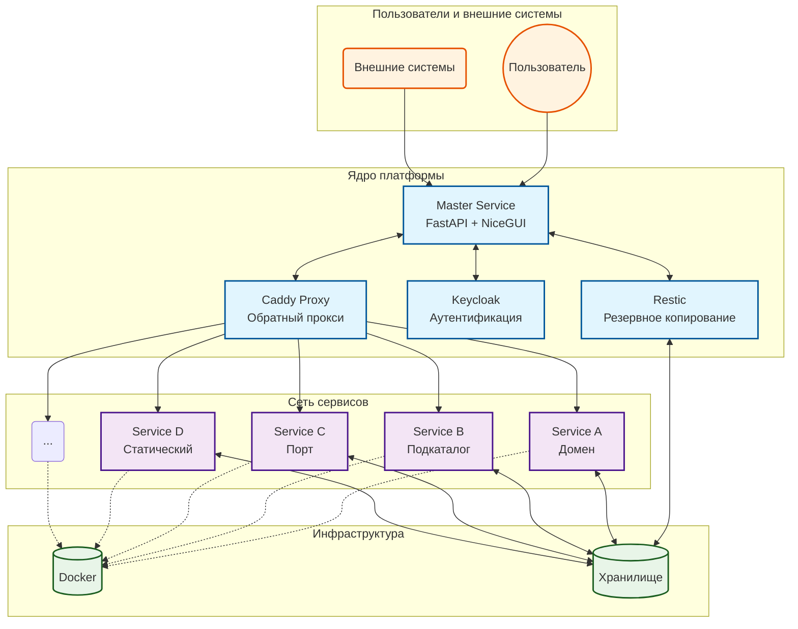

# Архитектура платформы управления сервисами

## 1. Общее описание архитектуры платформы

Платформа управления сервисами представляет собой комплексное решение для автоматизации развертывания, управления и мониторинга различных типов сервисов на сервере Ubuntu. Архитектура платформы построена по принципу микросервисов и включает в себя следующие ключевые компоненты:

1. **Master Service** ` центральный сервис управления, реализованный на Python с использованием FastAPI и NiceGUI
2. **Caddy Proxy** ` обратный прокси-сервер для маршрутизации трафика
3. **Docker** ` контейнеризация приложений
4. **Restic** ` система резервного копирования

Архитектура обеспечивает минимальное участие DevOps при развертывании и управлении сервисами, поддерживает различные типы сервисов (статические сайты, Docker-контейнеры, docker-compose проекты) и обеспечивает централизованное управление бэкапами, обновлениями и логами.

## 2. Описание компонентов платформы

### Master Service

**Master Service** ` центральный компонент платформы, реализованный на Python с использованием FastAPI и NiceGUI. Он обеспечивает:

- Управление сервисами (развёртывание, остановка, перезапуск)
- Мониторинг состояния сервисов
- Управление логами
- Управление бэкапами
- Генерация конфигураций Caddy через шаблоны
- Интеграция с Keycloak для аутентификации
- Отправку уведомлений через Telegram

#### Модули Master Service:

- API (FastAPI)
- Web UI (NiceGUI)
- Модуль обнаружения сервисов
- Docker-менеджер
- Caddy-конфигуратор
- Backup-менеджер (через Restic)
- Лог-агрегатор
- Уведомления (Telegram)
- Мониторинг состояния

Расположение:  
`apps/_core/master/`

Файлы:

- `docker-compose.yml`, `Dockerfile`, `pyproject.toml`
- Исходный код: `app/`
- База данных: `master.db` (SQLite)

### Caddy Proxy

**Caddy** ` обратный прокси-сервер, отвечающий за:

- SSL/TLS терминацию (автоматическое получение сертификатов Let's Encrypt)
- Маршрутизацию трафика к сервисам
- Аутентификацию через Keycloak (OAuth2)
- Rate limiting, защиту от DDoS
- Динамическую конфигурацию через Caddy API

Конфигурация генерируется Master Service и применяется динамически.

Расположение:  
`apps/_core/caddy/`

Структура:

- `Caddyfile` ` основной конфиг
- `conf.d/` ` автогенерируемые конфиги сервисов
- `snippets/`, `templates/` ` шаблоны и сниппеты
- `sites/` ` статические сайты (если есть)
- `data/`, `config/`, `logs/` ` внутренние директории Caddy

### Docker

Docker используется для контейнеризации всех компонентов платформы:

- Master Service
- Caddy
- Сервисы (`apps/services/`)
- Backup и Monitoring (опционально)

Управление осуществляется через Docker Compose. Все `docker-compose.yml` находятся в соответствующих папках ядра и сервисов.

### Restic

**Restic** ` инструмент для инкрементальных, шифруемых и дедуплицированных бэкапов.

Интегрирован через скрипты и расписания:

- Расположение: `apps/_core/backup/`
- Скрипты: `scripts/`
- Расписания: `schedules/` (cron-like)
- Запускается как отдельный сервис через `docker-compose.yml`

## 3. Диаграммы архитектуры

### Общая архитектура



## 4. Потоки данных между компонентами

### Поток управления:

1. Пользователь взаимодействует с Master Service (UI или API)
2. Master Service сканирует `apps/services/` и обнаруживает изменения
3. Генерирует Caddy-конфиг ` отправляет через API Caddy
4. Управляет Docker-контейнерами через Docker SDK
5. Запускает бэкапы через Restic (по расписанию или вручную)
6. Отправляет уведомления в Telegram

### Поток данных:

- Внешний трафик `Caddy` нужный сервис (внутри Docker network)
- Логи сервисов ` собираются Master Service
- Данные бэкапов ` экспортируются в удалённое хранилище (S3, SFTP и т.д.)

## 5. Актуальная файловая структура

```shell
apps/
├── backups/                     # Результаты бэкапов (локально)
├── _core/
│   ├── backup/                  # Сервис бэкапов (Restic + cron)
│   │   ├── docker-compose.yml
│   │   ├── scripts/             # Скрипты создания/восстановления
│   │   └── schedules/           # Расписания (cron-like)
│   ├── caddy/                   # Caddy Proxy
│   │   ├── Caddyfile
│   │   ├── conf.d/              # Автогенерируемые конфиги
│   │   ├── snippets/
│   │   ├── templates/
│   │   ├── data/
│   │   ├── config/
│   │   ├── logs/
│   │   └── docker-compose.yml
│   ├── master/                  # Master Service
│   │   ├── app/                 # Исходный код
│   │   ├── Dockerfile
│   │   ├── docker-compose.yml
│   │   ├── pyproject.toml       # Зависимости (Poetry)
│   │   └── master.db            # SQLite БД
├── services/                    # Основная директория сервисов
│   ├── public/                  # Публичные сервисы (доступны извне)
│   └── internal/                # Внутренние сервисы (только в сети)
└── shared/
    └── templates/               # Шаблоны для новых сервисов
        ├── service.yml          # Конфиг сервиса
        └── docker-compose.yml   # Шаблон compose

docs/                            # Документация
├── architecture/                # Архитектура
├── api/                         # API спецификации
├── user-guide/                  # Руководства
└── best-practices/              # Рекомендации

install.sh                       # Скрипт установки
```

## 6. Используемые технологии

| Компонент     | Технология                         |
| ------------- | ---------------------------------- |
| Backend       | Python, FastAPI                    |
| Frontend      | NiceGUI                            |
| Proxy         | Caddy (with API)                   |
| Auth          | Keycloak (OAuth2)                  |
| Backup        | Restic (частично: rsync, pg_dump работают; upload в Restic — нет) |
| Orchestration | Docker + Docker Compose            |
| DB            | SQLite (master.db)                 |
| Templating    | Jinja2                             |
| Logging       | Docker API (контейнеры); Loki — не реализован |

## 7. Масштабируемость и отказоустойчивость

### Масштабируемость

- **Сервисы**: могут масштабироваться через `deploy.replicas` в `docker-compose.yml`
- **Master Service**: может быть запущен в нескольких экземплярах (при переходе на PostgreSQL)
- **Caddy**: поддерживает высокую нагрузку, но требует stateful хранения сертификатов

### Отказоустойчивость

- **Docker restart policies**: `unless-stopped` для всех сервисов
- **Бэкапы**: ежедневные + проверка целостности
- **Восстановление**: автоматическое восстановление из бэкапа при сбое
- **Уведомления**: Telegram-бот информирует о сбоях

## 8. Управление

CLI — `platform` (Python/Typer). Веб — NiceGUI на порту 8001.

```bash
platform list            # сервисы со статусом
platform deploy my-app   # деплой
platform logs my-app     # логи
platform status          # статус + метрики
```

Подробнее — [CLI и UI](getting-started/cli-ui.md).
