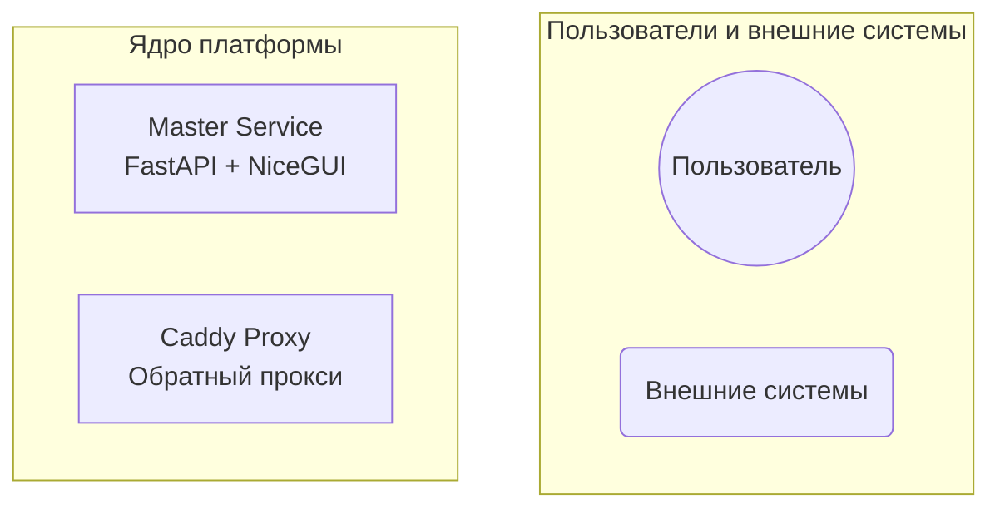

# Документация для разработчиков: работа с документацией

## Общие принципы

Документация проекта ведётся в формате Markdown и собирается с помощью MkDocs. Все файлы находятся в директории `docs/`. Для локального просмотра используется команда `mkdocs serve`.

## Добавление диаграмм Mermaid

Платформа поддерживает отрисовку диаграмм с помощью [Mermaid](https://mermaid.js.org/). Конфигурация уже настроена в `mkdocs.yml` через расширение `pymdownx.superfences`.

### Как добавить диаграмму

1. Используйте блок кода с указанием языка `mermaid`:

   ````markdown
   ```mermaid
   graph TB
       A[Начало] --> B{Решение}
       B -->|Да| C[Действие 1]
       B -->|Нет| D[Действие 2]
   ```
   ````

2. Диаграмма будет автоматически отрисована на странице документации (локально и на GitHub Pages).

### Поддерживаемые типы диаграмм

Mermaid поддерживает множество типов диаграмм, включая:

- **Графы (graph)** — для отображения архитектуры, зависимостей, потоков данных
  ```mermaid
  graph LR
      Client -->|Запрос| Server
      Server -->|Ответ| Client
  ```

- **Sequence diagram (sequenceDiagram)** — для последовательностей вызовов
  ```mermaid
  sequenceDiagram
      participant U as Пользователь
      participant M as Master Service
      participant C as Caddy
      U->>M: Запрос на деплой
      M->>C: Сгенерировать конфиг
      C-->>M: OK
      M-->>U: Успешно
  ```

- **ER-диаграммы (erDiagram)** — для схемы базы данных
  ```mermaid
  erDiagram
      USER ||--o{ SERVICE : создаёт
      SERVICE ||--o{ DEPLOYMENT : имеет
      DEPLOYMENT ||--|| CONTAINER : запускает
  ```

- **Gantt (gantt)** — для временных шкал
- **Pie chart (pie)** — для круговых диаграмм

### Пример из существующей документации

В файле [`docs/architecture.md`](../architecture.md) уже используется диаграмма графа:



### Проверка рендеринга

- **Локально**: запустите `mkdocs serve` и откройте страницу в браузере.
- **На GitHub Pages**: после пуша в ветку `main` диаграммы будут отображаться автоматически (если сборка прошла успешно).

### Ограничения

- Вложенные блоки кода внутри Mermaid не поддерживаются.
- Некоторые сложные конструкции могут требовать последней версии Mermaid (проверьте настройки темы Material).
- Если диаграмма не отображается, убедитесь, что блок кода имеет точный синтаксис ` ```mermaid ` и закрыт тремя обратными апострофами.

## Структура документации

- `docs/` — корневая директория
  - `index.md` — главная страница
  - `architecture.md` — архитектура платформы (содержит Mermaid-диаграммы)
  - `development/` — документация для разработчиков
  - `user-guide/` — руководства для пользователей
  - `reference/` — справочные материалы
  - `plan/` — план задач и архитектурные решения

## Редактирование и добавление новых страниц

1. Создайте новый Markdown-файл в соответствующей поддиректории.
2. Добавьте ссылку на файл в `mkdocs.yml` в разделе `nav`.
3. Проверьте локально с помощью `mkdocs serve`.
4. Закоммитьте изменения и отправьте в репозиторий.

## Ссылки

- [Официальная документация Mermaid](https://mermaid.js.org/intro/)
- [MkDocs Material документация](https://squidfunk.github.io/mkdocs-material/)
- [Расширение pymdownx.superfences](https://facelessuser.github.io/pymdown-extensions/extensions/superfences/)